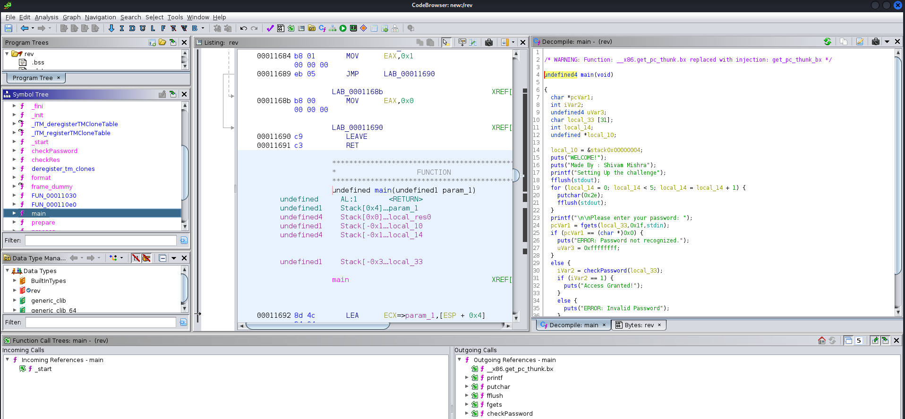

# Rev-Bin

I used the command **file** and **strings** to get the basic idea of the file.

Now, I know that it is an executable file, so I used **Ghidra**, to decomplie the code.  
The decompiled code can be found [here](./Assets/decompiled_code)

In checkAccessCode :
____________________________________________________________________________________________________
  process(Input,&local_88);
  prepare(Input);
  local_10 = verify(Input,sig,(size_t)siglen,tbs,local_8c);
  format(Input,&stack0xffffff74);
  iVar1 = checkResult(local_8c);
  return (uint)(iVar1 == 1); 
}
____________________________________________________________________________________________________

In the functions : (process, prepare, verify, format, checkResult)
We hace to make the checkResult function to return 1:
`iVar1 = checkResult(local_8c);
return (uint)(iVar1 == 1);`
[+] checResult function ::::
____________________________________________________________________________________________________
undefined4 checkResult(int param_1){
  int iVar1;
  int *piVar2;
  int *piVar3;
  int local_88 [30];
  int local_10;
  
  iVar1 = 0x1e;
  piVar2 = &&DAT_000120c0;
  piVar3 = local_88;
  while (iVar1 != 0) {
    iVar1 = iVar1 + -1;
    *piVar3 = *piVar2;
    piVar2 = piVar2 + 1;
    piVar3 = piVar3 + 1;
  }
  local_10 = 0;
  while( true ) {
    if (0x1d < local_10) {
      return 1;
    }
    if (local_88[local_10] != *(int *)(param_1 + local_10 * 4)) break;
    local_10 = local_10 + 1;
  }
  return 0
}
____________________________________________________________________________________________________
It is noting but Checking the Argument with the &&DAT_000120c0;
Equal or Not ; The Argument has to be Equal to $&DAT_000120c0
from `if (0x1d < local_10)` we confirm that the length is 0x1d+1 means `30` 
